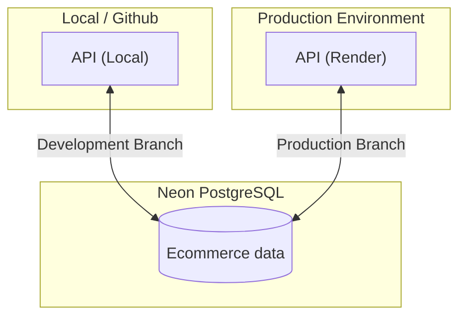
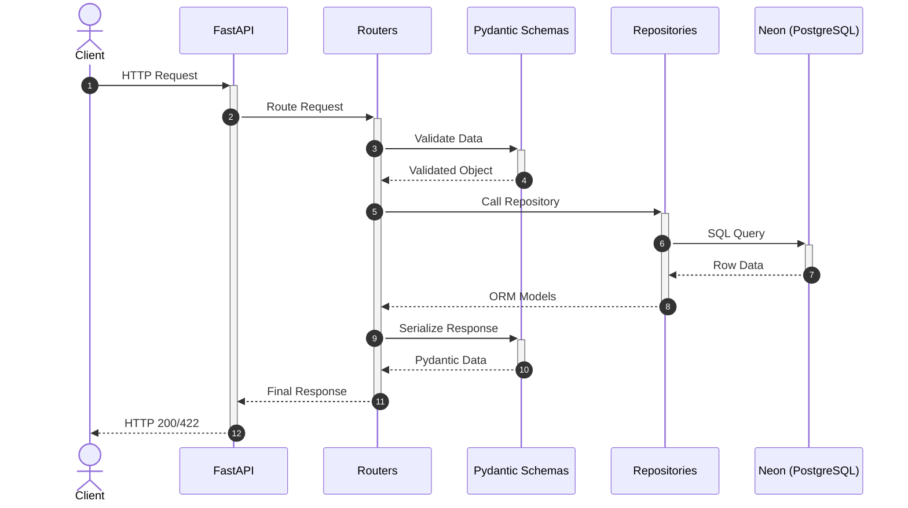
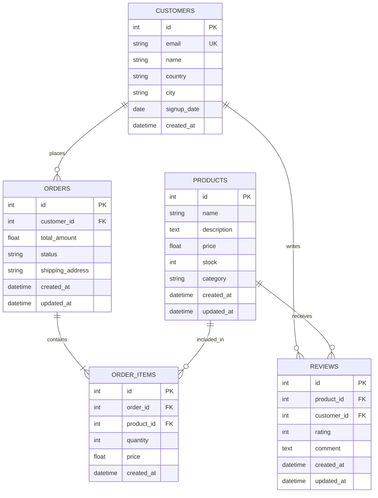
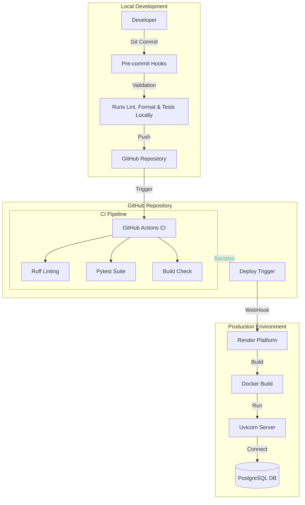
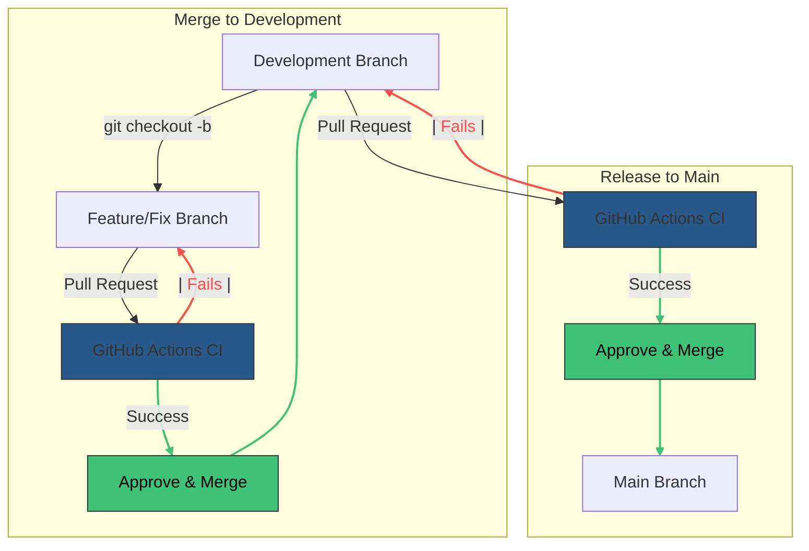

## Navigational Context

Authoritative constraints: see `AGENTS.md`

`app/routers/`        → FastAPI routers (HTTP only, read-only for agents)\
`app/models/`         → ORM models (read-only)\
`app/schemas/`        → Pydantic schemas (validation logic allowed)\
`app/database.py`     → All DB access (SQLAlchemy)\
`app/utils/`          → shared helpers (editable)\
`app/repositories/`   → Database access layer (editable)\
`tests/`              → unit + integration tests\
`docs/`               → architecture, data models, business rules, ADRs\

Rules:
- All database access only in `app/database.py`.

---

# FastAPI Analytics Project

[Link to API](https://fastapi-analytics-project.onrender.com/docs)

This application goes beyond standard CRUD operations by offering **distinct data insights** extracted directly from the ecommerce database. It adds significant value to the business by providing a **deep understanding of performance metrics**, enabling data-driven decision-making through quick and efficient API interpretations.

## 📋 Table of Contents
- [Features](#features)
- [Project Structure](#project-structure)
- [Architecture & Design](#architecture--design)
- [Database Tables Diagram](#database-tables-diagram)
- [Setup](#setup)
- [API Usage Examples](#api-usage-examples)
- [Running Tests](#running-tests)
- [CI/CD & Engineering Standards](#cicd--engineering-standards)
- [Branch Strategy](#branch-strategy)

## Features

- **Agentic Development**: Optimized for AI Agents. Includes a **Navigational Context** map to guide file traversal and a dedicated `/docs` directory containing architecture, conventions, and context rules to direct AI agents effectively.
- **FastAPI**: Modern, high-performance web framework for building APIs with Python.
- **Pydantic**: Ensures strict data validation and settings management using Python type hints.
- **SQLAlchemy ORM**: Powerful toolkit for Python database interaction and object-relational mapping.
- **PostgreSQL (Neon)**: Robust, serverless relational database for scalable data storage.
- **Alembic**: Database migration tool to manage schema changes and versioning.
- **Business Analytics**: Custom endpoints for real-time data insights and dashboard metrics.
- **Pytest**: Comprehensive test suite covering every endpoint to ensure reliability, including **System Health** checks for Neon database connectivity.
- **Ruff**: Ultra-fast linter and formatter to enforce code quality and style.
- **Pre-commit**: Local git hooks that automatically run *Ruff* (lint/format) and *Pytest* before every commit to ensure code quality. _(Only if there's a modification inside `/app`)_
- **Docker**: Containerization platform for consistent development and production environments.
- **GitHub Actions**: Automates *CI/CD pipelines* for testing, building, and deployment.
- **Render**: Unified cloud platform for seamless application hosting and zero-downtime deploys.

## Project Structure

```
fastapi-ecommerce/
├── .github/workflows/   # CI/CD workflows
├── alembic/             # Database migrations
├── app/
│   ├── models/          # SQLAlchemy database models
│   ├── repositories/    # Database access layer
│   ├── routers/         # API route handlers
│   ├── schemas/         # Pydantic schemas for validation
│   └── utils/           # Utility functions and dependencies
├── docs/                # Architecture, data models, business rules, ADRs
├── tests/               # Test suite
```

## Architecture & Design


<div align="center">

### General Architecture



### **Layered Architecture**



</div>

### Request-Response Lifecycle
1.  **Request & Validation**: FastAPI receives the HTTP request, and the router uses Pydantic schemas to ensure data integrity and correct typing before any business logic is executed.
2.  **Data Access Layer**: Routers interact with repositories to fetch or persist data using SQLAlchemy models, abstracting the database interaction and SQL complexity.
3.  **Serialization & Response**: The returned database models are converted back into clean Pydantic schemas, ensuring the client receives exactly what the API contract specifies (filters sensitive data, formats fields).

**Benefits:**
- **Predictability**: Strictly typed schemas prevent unexpected data formats from entering or leaving the system, reducing runtime errors.
- **Separation of Concerns**: Each layer (Router, Schema, Repo, DB) has a single responsibility, making the codebase easier to test, debug, and maintain.
- **Auto-Documentation**: Integration with Pydantic allows FastAPI to generate interactive Swagger/ReDoc documentation automatically.

**Problems Solved:**
- **Data Corruption**: Prevents invalid or malicious data from reaching the database by filtering at the schema level.
- **Tight Coupling**: Decouples the API's external interface (Schemas) from the underlying database structure (Models), allowing schema changes without breaking the DB.
- **Manual Mapping Boilerplate**: Automated serialization removes the need for manual object-to-JSON mapping, reducing human error.

<div align="center">

## **Database Tables Diagram**



</div>

### Relational Database Design
1.  **Core Entities**: The system tracks four main entities: `Customers`, `Products`, `Orders`, and `Reviews`, with `Order_Items` acting as a junction table to manage the many-to-many relationship between orders and products.
2.  **Referential Integrity**: Strict Foreign Key (FK) constraints ensure that orders and reviews are always linked to existing customers and products, maintaining a consistent state across the platform.
3.  **Auditability**: Every table includes automated timestamping (`created_at`, `updated_at`), providing a clear audit trail for every transaction and interaction.

**Benefits:**
- **Data Consistency**: Relational constraints prevent "orphan" data, ensuring that an order cannot exist without a customer.
- **Scalability**: Normalized table structures minimize data redundancy, optimizing storage and query performance for analytical tasks.
- **Reporting Clarity**: The clear structure allows for complex SQL queries to derive business insights (e.g., average product rating by category).

**Problems Solved:**
- **Data Redundancy**: Prevents duplicating product or customer details in every order, reducing the risk of inconsistent information.
- **Anomalies**: Avoids update and deletion anomalies through proper normalization (3NF approach).
- **History Tracking**: Solves the problem of losing historical data by using dedicated audit fields on every record.


## Setup

### Prerequisites

- Python 3.11+
- Docker (optional)
- Setup PostgreSQL DB in [Neon](https://neon.com/)
- Setup a Web Service in [Render](https://render.com/)

### Installation

1. Clone the repository:
```bash
git clone https://github.com/EmanuelRodriguezBedeman/fastapi-analytics-project.git analytics-api
cd analytics-api
```

2. Create a virtual environment:
```bash
python -m venv analytics-api
source analytics-api/bin/activate  # On Windows: analytics-api\Scripts\activate
```

> **Note:** If creating an environment with a different name, remember to update the `pre-commit` configuration in `pyproject.toml` to use the new environment name, on line 17.

3. Install dependencies:
```bash
pip install -r requirements.txt
pip install -r requirements-dev.txt
```

4. Set up environment variables:
- **macOS / Linux**:
```bash
cp .env.example .env
```
- **Windows (Command Prompt)**:
```cmd
copy .env.example .env
```
- **Windows (PowerShell)**:
```powershell
cp .env.example .env
```

> **Note:** Edit `.env` with your database credentials and settings.

5. Run database migrations:
```bash
alembic upgrade head
```

6. Populate the database (Optional):
Generating realistic mock data for local testing and analytics.
```bash
python scripts/seeder.py
```

7. Start the development server:
```bash
uvicorn app.main:app --reload
```

The API will be available at `http://localhost:8000`

API documentation will be available at:
- **Swagger UI**: `http://localhost:8000/docs`
- **ReDoc**: `http://localhost:8000/redoc`

## API Usage Examples

### 1. Order Analytics
Get aggregated counts of orders grouped by their current status.
**Endpoint**: `GET /orders/statuses`

<details>
<summary>View Example</summary>

**Request**:
```bash
curl http://localhost:8000/orders/statuses
```

**Response**:
```json
[
    {
        "status": "shipped",
        "count": 313
    },
    {
        "status": "pending",
        "count": 153
    },
    {
        "status": "cancelled",
        "count": 153
    },
    {
        "status": "delivered",
        "count": 2159
    },
    {
        "status": "processing",
        "count": 224
    }
]
```
</details>

### 2. Product Reviews
Retrieve reviews for a specific product using query parameters for pagination and filtering.
**Endpoint**: `GET /reviews/`

<details>
<summary>View Example</summary>

**Request**:
```bash
curl "http://localhost:8000/reviews/?skip=0&limit=1&product_id=260"
```

**Response**:
```json
[
    {
        "product_id": 260,
        "customer_id": 643,
        "rating": 3,
        "comment": "Does the job.",
        "id": 67,
        "created_at": "2025-05-10T18:49:28Z",
        "updated_at": null
    }
]
```
</details>

### 3. Order Details
Retrieve specific order information including shipping address and current status.
**Endpoint**: `GET /orders/{id}`

<details>
<summary>View Example</summary>

**Request**:
```bash
curl http://localhost:8000/orders/50
```

**Response**:
```json
{
    "shipping_address": "15689 Lewis Loaf Suite 049\nHayesfort, CT 62687",
    "id": 50,
    "customer_id": 550,
    "total_amount": 644.99,
    "status": "delivered",
    "created_at": "2025-03-07T12:06:10Z",
    "updated_at": "2026-01-28T20:20:24.709671Z"
}
```
</details>

## Development Setup
1. Activate environment: `conda activate analytics-api`
2. Install pre-commit: `pre-commit install`
3. Commit as usual (pre-commit will use your active env) _(Only if there's a modification inside `/app`)_

## Running Tests

Automated tests ensure the API behaves as expected across all layers.

```bash
pytest tests/ -v
```

### Test Execution Examples

#### 1. Integration: Product List (✅ PASS)
Reflects: `tests/test_products.py`
Confirms that the main product catalog is reachable and correctly paginated.

<details>
<summary>View Test Case</summary>

**Request**:
```bash
curl http://localhost:8000/products/?skip=0&limit=1
```

**Response (200 OK)**:
```json
[
    {
        "name": "Jackson-Garcia Running Shoes",
        "description": "Ergonomic design providing comfort during extended use.",
        "price": 381.82,
        "stock": 79,
        "category": "Sports",
        "id": 251,
        "created_at": "2026-01-28T19:58:48.360618Z",
        "updated_at": null
    }
]
```
</details>

#### 2. Analytics: Order Statuses (❌ FAIL)
Reflects: `tests/test_orders.py`
Demonstrates a validation failure when an invalid status is provided in the query string.

<details>
<summary>View Test Case</summary>

**Request**:
```bash
curl "http://localhost:8000/orders/statuses?order_status=pendig"
```

**Response (422 Unprocessable Entity)**:
```json
{
  "detail": [
    {
      "type": "enum",
      "loc": ["query", "order_status"],
      "msg": "Input should be 'pending', 'processing', 'shipped', 'delivered' or 'cancelled'",
      "input": "pendig",
      "ctx": {
        "expected": "'pending', 'processing', 'shipped', 'delivered' or 'cancelled'"
      }
    }
  ]
}
```

**Why it fails?**
The `order_status` parameter is strictly validated against the `OrderStatus` Enum. As shown in the request, a typo ("pendig" instead of "pending") triggers an automatic 422 error, ensuring that the analytical engine only processes valid states defined in the domain model.
</details>

#### 3. Detail: Resource Not Found (❌ FAIL)
Reflects: [`test_get_product`](tests/test_products.py)
Shows what happens when a test attempts to fetch a specific record that does not exist.

<details>
<summary>View Test Case</summary>

**Request**:
```bash
curl http://localhost:8000/products/99999
```

**Response (404 Not Found)**:
```json
{
  "detail": "Product not found"
}
```

**Why it fails?**
While `test_get_product` is designed to find valid dynamic IDs, it will fail if the requested `product_id` is missing. This validates that the system correctly handles empty or missing resources without crashing.
</details>

## CI/CD & Engineering Standards

This project utilizes a fully automated pipeline alongside manual quality tools to ensure high standards and seamless deployment.

### CI/CD Pipeline Architecture
<div align="center">



</div>

### Pipeline Stages
1.  **Local Pre-commit**: Before committing, `pre-commit` hooks runs `ruff` (formatting/linting) and `pytest` to catch errors early.
2.  **Continuous Integration (GitHub Actions)**:
    - Automatically runs on every push/PR.
    - Executes `ruff` for code style enforcement.
    - Runs the full test suite with `pytest`.
3.  **Continuous Deployment (Render)**:
    - Automatically triggers when the CI pipeline passes on the `main` branch.
    - **Docker-based Build**: The `Dockerfile` copies the `/app` folder to the container and runs the Uvicorn server for seamless production deployment.

<div align="center">

## Branch Strategy



</div>

### Git Flow Strategy
1.  **Feature-driven Development**: All new features and fixes are developed in isolated branches created from `development`.
2.  **Double-gate Validation**:
    - **Step 1**: Feature branches must pass CI before merging into `development`.
    - **Step 2**: `development` must pass the full test suite again before merging into `main`.
3.  **Protected Production**: The `main` branch always represents a stable, deployable version of the application.

**Benefits:**
- **Stability**: Production code is never touched directly, reducing the risk of accidental breakage.
- **Code Quality**: Forced PR reviews and automated CI checks ensure high standards across all branches.
- **Parallel Work**: Multiple developers can work on different features simultaneously without interfering with each other.

**Problems Solved:**
- **Broken Production**: Prevents committing broken code directly to the live environment.
- **Merge Conflicts**: Small, frequent PRs to `development` make conflict resolution much more manageable.
- **Untested Releases**: Guarantees that every line of code in `main` has been verified at least twice.

