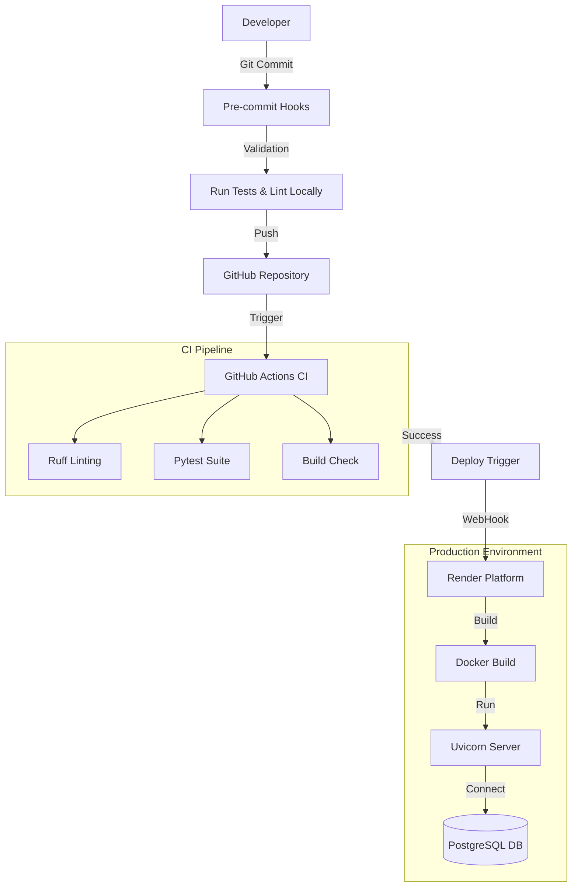

## Navigational Context

Authoritative constraints: see `AGENTS.md`

`app/routers/`        → FastAPI routers (HTTP only, read-only for agents)\
`app/models/`         → ORM models (read-only)\
`app/schemas/`        → Pydantic schemas (validation logic allowed)\
`app/database.py`     → All DB access (SQLAlchemy)\
`app/utils/`          → shared helpers (editable)\
`app/repositories/`   → Database access layer (editable)\
`tests/`              → unit + integration tests\
`docs/`               → architecture, data models, business rules, ADRs\

Rules:
- All database access only in `app/database.py`.

---

# FastAPI Analytics Project

[Link to API](https://fastapi-analytics-project.onrender.com/docs)

This application goes beyond standard CRUD operations by offering **distinct data insights** extracted directly from the ecommerce database. It adds significant value to the business by providing a **deep understanding of performance metrics**, enabling data-driven decision-making through quick and efficient API interpretations.

## Features

- **Agentic Development**: Optimized for AI Agents. Includes a **Navigational Context** map to guide file traversal and a dedicated `/docs` directory containing architecture, conventions, and context rules to direct AI agents effectively.
- **FastAPI**: Modern, high-performance web framework for building APIs with Python.
- **Pydantic**: Ensures strict data validation and settings management using Python type hints.
- **SQLAlchemy ORM**: Powerful toolkit for Python database interaction and object-relational mapping.
- **PostgreSQL (Neon)**: Robust, serverless relational database for scalable data storage.
- **Alembic**: Database migration tool to manage schema changes and versioning.
- **Business Analytics**: Custom endpoints for real-time data insights and dashboard metrics.
- **Pytest**: Comprehensive test suite covering every endpoint to ensure reliability, including **System Health** checks for Neon database connectivity.
- **Ruff**: Ultra-fast linter and formatter to enforce code quality and style.
- **Pre-commit**: Local git hooks that automatically run *Ruff* (lint/format) and *Pytest* before every commit to ensure code quality.
- **Docker**: Containerization platform for consistent development and production environments.
- **GitHub Actions**: Automates *CI/CD pipelines* for testing, building, and deployment.
- **Render**: Unified cloud platform for seamless application hosting and zero-downtime deploys.

## Project Structure

```
fastapi-ecommerce/
├── .github/workflows/   # CI/CD workflows
├── alembic/             # Database migrations
├── app/
│   ├── models/          # SQLAlchemy database models
│   ├── repositories/    # Database access layer
│   ├── routers/         # API route handlers
│   ├── schemas/         # Pydantic schemas for validation
│   └── utils/           # Utility functions and dependencies
├── docs/                # Architecture, data models, business rules, ADRs
├── tests/               # Test suite
```

## 🏗️ Architecture & Design

### Domain-Driven Design (DDD)
The project follows a modular architecture where each domain (Orders, Products, Customers) is self-contained.
- **Consolidated Domains**: Recently, the `order_status` domain was fully consolidated into the `orders` domain to improve cohesion and reduce fragmentation.

### Key Features
- **Analytics**: Dedicated endpoints (e.g., `/orders/statuses`) for real-time business metrics, implemented with efficient database-level aggregation.
- **Rate Limiting**: Custom token-bucket rate limiter to protect API resources.
- **Code Quality**: Enforced via `ruff` (linter/formatter) and `mypy` (static type checking) in CI/CD pipeline.


## Setup

### Prerequisites

- Python 3.11+
- PostgreSQL 15+
- Docker (optional)

### Installation

1. Clone the repository:
```bash
git clone <repository-url>
cd fastapi-ecommerce
```

2. Create a virtual environment:
```bash
python -m venv analytics-api
source analytics-api/bin/activate  # On Windows: analytics-api\Scripts\activate
```

3. Install dependencies:
```bash
pip install -r requirements.txt
pip install -r requirements-dev.txt
```

4. Set up environment variables:
```bash
cp .env.example .env
# Edit .env with your database credentials and settings
```

5. Run database migrations:
```bash
alembic upgrade head
```

6. Start the development server:
```bash
uvicorn app.main:app --reload
```

The API will be available at `http://localhost:8000`

API documentation will be available at:
- Swagger UI: `http://localhost:8000/docs`
- ReDoc: `http://localhost:8000/redoc`

## Development Setup
1. Activate environment: `conda activate analytics-api`
2. Install pre-commit: `pre-commit install`
3. Commit as usual (pre-commit will use your active env)

## Running Tests

```bash
pytest tests/ -v
```

## Development Workflow

This project uses [Ruff](https://docs.astral.sh/ruff/) for linting/formatting. Configuration is centralized in `pyproject.toml`.

Format code:
```bash
ruff format .
```

Lint code (fix auto-fixable issues):
```bash
ruff check . --fix
```

## Docker

Build and run with Docker:

```bash

## 🚀 Deployment Architecture & CI/CD

The project utilizes a fully automated pipeline to ensure code quality and seamless deployment.



### Pipeline Stages
1.  **Local Pre-commit**: Before committing, `pre-commit` hooks runs `ruff` (formatting/linting) and `pytest` to catch errors early.
2.  **Continuous Integration (GitHub Actions)**:
    - Automatically runs on every push/PR.
    - Executes `ruff` for code style enforcement.
    - Runs the full test suite with `pytest`.
3.  **Continuous Deployment (Render)**:
    - Automatically triggers when the CI pipeline passes on the `main` branch.
    - Builds the Docker image.
    - Deploys the new version with zero-downtime.
